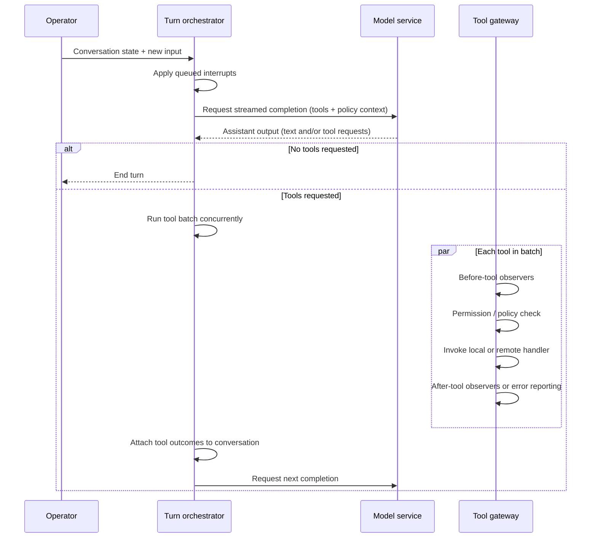

# Klauso

**Klauso** is a **single-process, async Python** terminal harness around the **Anthropic Messages API**: one lead agent with streaming, parallel tool execution, YAML permissions, an event bus, persisted sessions, context compaction, todos and a task graph, skills, background shell jobs, optional teammate threads and autonomous workers, git worktrees, MCP (stdio) tools, subagents, and cooperative interrupts.

Install from PyPI (when published) or from a checkout.

## Quick start (pip / pipx)

| Step | Command / action |
|------|------------------|
| 1 | `pipx install klauso` **or** `pip install klauso` |
| 2 | `cd` your project (workspace) |
| 3 | Copy [`.env.example`](.env.example) to `.env` in that directory and set `ANTHROPIC_API_KEY` |
| 4 | Run `klauso` |

Optional CLI flags (set before other imports; use for non-default layout):

| Flag | Effect |
|------|--------|
| `--workspace DIR` | Sets `KLAUSO_WORKSPACE` (default: current directory). |
| `--config-dir DIR` | Sets `KLAUSO_CONFIG_DIR` for `permissions.yaml` and `mcp_config.yaml`. |
| `--skills-dir DIR` | Sets `KLAUSO_SKILLS_DIR` for `list_skills` / `load_skill`. |

If `./config/permissions.yaml` (and `mcp_config.yaml`) are missing, Klauso **seeds** them from bundled defaults on first run. If `./skills/` is empty or missing, bundled skills under the package are used.

## Quick start (from this repository)

| Step | Command / action |
|------|------------------|
| 1 | `cd` to repository root |
| 2 | `python3 -m venv .venv && source .venv/bin/activate` |
| 3 | `pip install -e ".[dev]"` |
| 4 | `cp .env.example .env` and set `ANTHROPIC_API_KEY` |
| 5 | `klauso` **or** `python main.py` **or** `python -m klauso` |

Environment variables are loaded from **`<workspace>/.env`** first, then process environment (see `klauso.core.client`).

## Architecture at a glance

| Layer | Role |
|-------|------|
| **`klauso/cli.py`** | Async REPL, session commands, MCP async context, workers/teammates, drives `run_until_idle`. |
| **`klauso/core/`** | `client` (Anthropic + `dotenv`), `settings` (model, cache mode, feature flags, `CONFIG_DIR`, `SKILLS_DIR`). |
| **`klauso/harness/`** | Agent loop, tool merge + dispatch, MCP lifespan, events, interrupts, sessions, cache, tasks/todos, background bash, teams, worktrees, sync dispatch. |
| **`klauso/tools/`** | JSON tool schemas, permission checks, filesystem/shell builtins. |
| **`klauso/memory/`** | History compression + `.agent_memory.md`. |
| **`klauso/subagents/`** | `spawn_subagent`. |
| **`klauso/utils/`** | Message serialization for saved sessions. |
| **`config/`** (in workspace) | `permissions.yaml`, `mcp_config.yaml` — see [config/README.md](config/README.md). Defaults ship in `klauso/resources/`. |
| **`skills/`** (optional) | `SKILL.md` per folder; else bundled skills. |

### Turn lifecycle



## Repository layout (development)

| Path | Contents |
|------|----------|
| `src/klauso/` | Installable package (`cli`, `core`, `harness`, `tools`, …) |
| `src/klauso/resources/` | Default `permissions.yaml`, `mcp_config.yaml`, bundled `skills/` |
| `pyproject.toml` | PEP 621 metadata, `klauso` console script, dependencies |
| `main.py` | Dev shim: prepends `src/` and runs `klauso.cli:main` |
| `config/` | Reference copies for the repo workspace |
| `tests/` | Pytest |

## Tools exposed to the lead agent

Same as before: built-ins, todos, tasks, skills, background bash, teams (optional), worktrees, subagent, and dynamic `mcp__<server>__<name>` from `mcp_config.yaml`.

Default MCP servers in packaged defaults: **filesystem** (`@modelcontextprotocol/server-filesystem`) and **GitHub** (`@modelcontextprotocol/server-github`). Add more **stdio** entries under `servers:` in `config/mcp_config.yaml`. GitHub tools expect a suitable token in the environment (e.g. `GITHUB_TOKEN`).

## Runtime artifacts

| Artifact | Purpose |
|----------|---------|
| `.sessions/*.json` | Persisted `messages` + metadata |
| `.agent_todo.json` | Todo list |
| `.agent_tasks.json` | Task board |
| `.mailboxes/*.jsonl` | Lead ↔ teammate messages |
| `.agent_events.log` | Hook logger output |
| `.agent_memory.md` | Compaction summaries |

## Configuration

| Variable | Effect |
|----------|--------|
| `ANTHROPIC_API_KEY` | Required for API calls |
| `MODEL_ID` | Default `claude-sonnet-4-5-20250929` |
| `ANTHROPIC_BASE_URL` | Optional gateway |
| `CACHE_MODE` | `anthropic` (default) or `off` |
| `ENABLE_TEAMS` | `1` / `0` |
| `ENABLE_AUTONOMOUS_WORKERS` | `1` / `0` |
| `HARNESS_DEBUG` | Extra logging |
| `KLAUSO_WORKSPACE` | Workspace root (optional; default `.`) |
| `KLAUSO_CONFIG_DIR` | Directory with `permissions.yaml` and `mcp_config.yaml` |
| `KLAUSO_SKILLS_DIR` | Skills root directory |

YAML details: [config/README.md](config/README.md).

## REPL commands

| Command | Behavior |
|---------|----------|
| *(normal text)* | User message; model runs; session saved after turn |
| `:sessions` | List saved sessions |
| `:resume <id>` | Load session |
| `:fork <id>` | Copy session to new id |
| `:title <text>` | Rename session |
| `:save` | Persist now |
| `q` / `exit` / `quit` | Save and exit |
| Ctrl+C during stream | Abort stream; interrupt may be injected |
| Ctrl+C during tools | Queue interrupt for after current step |

## Optional LiteLLM gateway

1. Optionally add `litellm[proxy]` to your environment.
2. Run LiteLLM with your config.
3. Point `.env` at `ANTHROPIC_BASE_URL` and align `MODEL_ID`.

If the proxy rejects prompt caching, set `CACHE_MODE=off`.

## Manual testing matrix

Use a throwaway branch or copy repo.

1. **Filesystem:** `read` → `write` → `revert` on a small file.  
2. **Parallel tools:** one turn with `read` + `glob` + `grep`.  
3. **Revert:** new file then edited file.  
4. **Shell:** `pwd`, `ls`, `git status` (read-only git).  
5. **Git ask:** `git commit` (expect confirmation prompt per `permissions.yaml`).  
6. **Deny:** command matching `always_deny` (e.g. `sudo ls`).  
7. **Todos:** `todo_write` → `todo_read` → `todo_update`.  
8. **Tasks:** `task_create` → `task_list` → `task_update` → `task_next`.  
9. **Skills:** `list_skills` → `load_skill`.  
10. **Background:** `bash_background` with short sleep; next line drains notification.  
11. **Teams** (`ENABLE_TEAMS=1`): `list_teammates` → `send_to_teammate`.  
12. **Worktrees:** `worktree_create` / `worktree_remove` on a test branch.  
13. **Subagent:** `spawn_subagent` with a narrow read-only prompt.  
14. **MCP filesystem:** call an `mcp__filesystem__*` tool within allowed roots.  
15. **MCP GitHub:** call an `mcp__github__*` tool with token set.  
16. **Extra MCP:** add a third stdio server in `mcp_config.yaml`, restart, verify tools.  
17. **Sessions:** `:save`, restart, `:resume <id>`; `:fork`, `:title`, `:sessions`.  
18. **Batch:** multiple tools with one denied — others still complete.  
19. **Install smoke:** fresh venv, `pip install dist/klauso-*.whl`, `klauso --help`.

## Tests

```bash
python3 -m pip install -e ".[dev]"
python3 -m pytest tests/ -q
```

## Publishing to PyPI

1. `python3 -m pip install build twine`  
2. `python3 -m build`  
3. Prefer **[Trusted Publishing](https://docs.pypi.org/trusted-publishers/)** from GitHub Actions over long-lived API tokens.  
4. `twine upload dist/*` as a fallback.

## ADR: Anthropic-native tool protocol

The harness uses the **Anthropic Python SDK** (`tool_use` / `tool_result`). Optional gateways may require `CACHE_MODE=off`.

## Planned improvements

| Area | Goal |
|------|------|
| **Parallel subagents** | Concurrent subagents with bounded fan-out and cancellation. |
| **Webhook-based tasks** | HTTP hooks on task lifecycle for external schedulers. |
| **Remote MCP** | Transports beyond stdio (HTTP/SSE). |

The **exportable package** goal is addressed by this **Klauso** distribution (`pip install klauso`).
