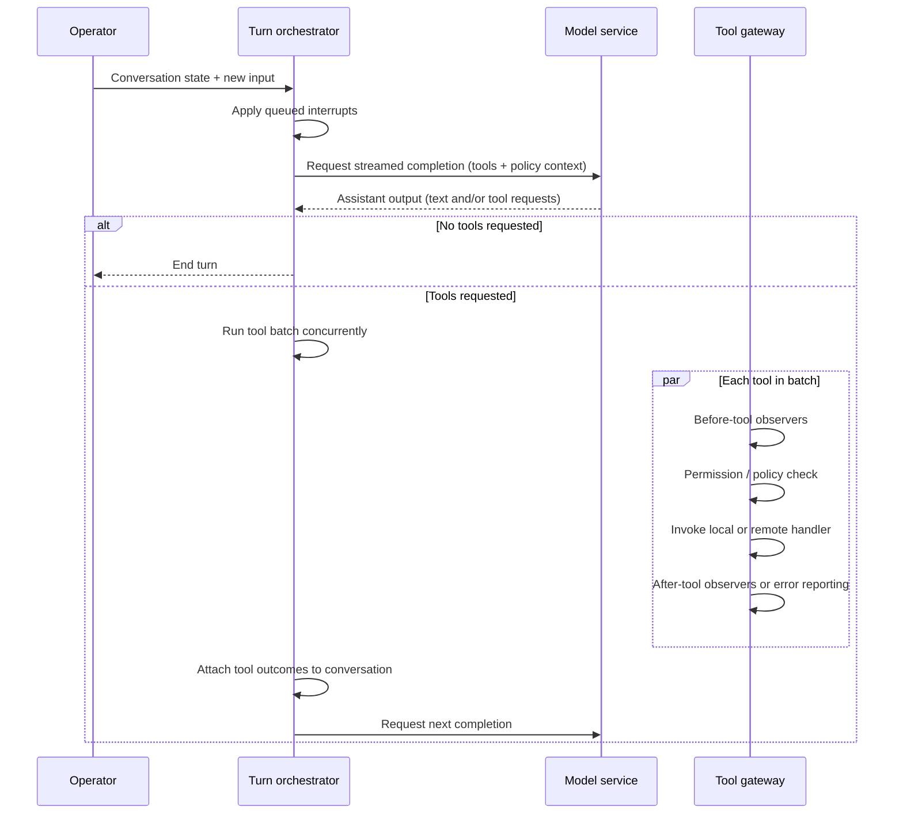

# Coding agent harness

A **single-process, async Python harness** around the **Anthropic Messages API**: one lead agent with streaming, parallel tool execution, YAML permissions, an event bus, persisted sessions, context compaction, todos and a task graph, repo-local skills, background shell jobs, optional teammate threads and autonomous workers, git worktrees, MCP (stdio) tools, subagents, and cooperative interrupts.

## Quick start

| Step | Command / action |
|------|------------------|
| 1 | `cd` to repository root |
| 2 | `python -m venv .venv && source .venv/bin/activate` |
| 3 | `pip install -r requirements.txt` |
| 4 | `cp .env.example .env` and set `ANTHROPIC_API_KEY` |
| 5 | `python -m main` or `python main.py` |

`main.py` prepends the repo root to `sys.path` so top-level packages (`core`, `harness`, `tools`, …) resolve when you run from the root.

## Architecture at a glance

| Layer | Role |
|-------|------|
| **`main.py`** | Async REPL, session commands, MCP async context, starts/stops workers and teammates, drains background notifications, triggers compaction, drives `run_until_idle`. |
| **`core/`** | `client` (Anthropic + `dotenv`), `settings` (model, cache mode, feature flags, paths). |
| **`harness/`** | Agent loop, tool merge + dispatch, MCP lifespan, events, interrupts, sessions, cache stats, tasks/todos, background bash, teams/mailboxes, worktrees, sync tool dispatch for threads. |
| **`tools/`** | JSON tool schemas, permission checks against YAML, filesystem/shell builtins. |
| **`memory/`** | Threshold-based history compression + `.agent_memory.md` append. |
| **`subagents/`** | Isolated `spawn_subagent` loop (extended tools only, sync dispatch). |
| **`utils/`** | Message serialization so saved sessions only contain API-legal fields. |
| **`config/`** | `permissions.yaml`, `mcp_config.yaml` — see [config/README.md](config/README.md). |
| **`skills/`** | Optional `SKILL.md` per folder; discovered via `list_skills` / `load_skill`. |

### Turn lifecycle



- **Streaming** runs in a thread pool; **SIGINT** cooperatively aborts the stream and enqueues interrupt text (`harness/interrupts.py`).
- **Tool batches** from one assistant message run **in parallel** via `asyncio.gather` (`harness/loop.py`).
- **MCP** servers are opened once inside `async with mcp_lifespan()` so all stdio sessions and cancel scopes stay in the same asyncio task (`harness/mcp_runtime.py`).

## Repository layout

| Path | Contents |
|------|----------|
| `main.py` | CLI entry, session loop, wiring |
| `__main__.py` | `python -m` shim → `main.main()` |
| `core/client.py` | Shared `Anthropic` client |
| `core/settings.py` | `MODEL_ID`, `CACHE_MODE`, flags, `CONFIG_DIR`, `SKILLS_DIR` |
| `harness/loop.py` | Merge tools, `run_until_idle`, `dispatch_one_tool` |
| `harness/mcp_runtime.py` | Stdio MCP, `mcp__<server>__<tool>` names |
| `harness/events.py` | `EventBus`, default hooks → `.agent_events.log` |
| `harness/sessions.py` | `.sessions/<id>.json` |
| `harness/tasks_todos.py` | `.agent_todo.json`, `.agent_tasks.json`, locks |
| `harness/background.py` | `bash_background` + notification queue |
| `harness/teams.py` | Teammate threads, `.mailboxes/*.jsonl` |
| `harness/workers.py` | Optional autonomous workers on task board |
| `harness/worktrees.py` | `git worktree` helpers |
| `harness/cache.py` | Prompt cache markers + `CacheStats` |
| `harness/tool_dispatch_sync.py` | Sync dispatch for threads/subagent |
| `tools/schemas.py` | `EXTENDED_TOOLS` definitions |
| `tools/builtin.py` | Async/sync bash, read, write, grep, glob, revert |
| `tools/permissions.py` | Regex rules + optional stdin confirm |
| `memory/compaction.py` | `maybe_compact` |
| `subagents/runner.py` | `spawn_subagent` |
| `utils/serialization.py` | Strip SDK-only keys before save/API round-trip |
| `tests/` | Pytest coverage for permissions, dispatch, serialization, compaction, mailbox lock |

## Tools exposed to the lead agent

Built-in and harness tools are merged in `build_merged_tool_definitions()`:

| Category | Tools |
|----------|--------|
| Filesystem / shell | `bash`, `read`, `write`, `grep`, `glob`, `revert` |
| Planning | `todo_write`, `todo_read`, `todo_update` |
| Task graph | `task_create`, `task_list`, `task_update`, `task_next` |
| Skills | `list_skills`, `load_skill` |
| Background | `bash_background` |
| Teams | `send_to_teammate`, `list_teammates` (when `ENABLE_TEAMS=1`) |
| Git | `worktree_create`, `worktree_remove` |
| Isolation | `spawn_subagent` |
| MCP | Dynamic `mcp__<server>__<name>` from `config/mcp_config.yaml` |

**Subagents and teammates** use `extended_dispatch_map()` — only the **extended filesystem tools** (`tools/schemas.py`), not todos/MCP/teams/etc., unless you extend that map.

## Runtime artifacts

| Artifact | Purpose |
|----------|---------|
| `.sessions/*.json` | Persisted `messages` + metadata |
| `.agent_todo.json` | Todo list from `todo_write` |
| `.agent_tasks.json` | Task board (workers claim via `claim_next_task`) |
| `.mailboxes/*.jsonl` | Lead ↔ teammate JSONL messages |
| `.agent_events.log` | Hook logger output (`[tool]`, `[mcp]`, `[err]`, `[perm]`) |
| `.agent_memory.md` | Appended summaries when history is compacted |

## Configuration

| Variable | Effect |
|----------|--------|
| `ANTHROPIC_API_KEY` | Required for API calls |
| `MODEL_ID` | Default `claude-sonnet-4-5-20250929` |
| `ANTHROPIC_BASE_URL` | Optional gateway (unset = direct Anthropic) |
| `CACHE_MODE` | `anthropic` (default) attaches cache breakpoints; `off` disables markers for proxies that reject them |
| `ENABLE_TEAMS` | `1` / `0` — teammate threads + mailbox tools |
| `ENABLE_AUTONOMOUS_WORKERS` | `1` spawns background threads that claim tasks |
| `HARNESS_DEBUG` | Extra boot and per-batch logging |

Details for YAML files: [config/README.md](config/README.md).

## REPL commands

| Command | Behavior |
|---------|----------|
| *(normal text)* | Appended as user message; model runs; session saved after turn |
| `:sessions` | List saved sessions |
| `:resume <id>` | Load session |
| `:fork <id>` | Copy session to new id |
| `:title <text>` | Rename session |
| `:save` | Persist now |
| `q` / `exit` / `quit` | Save and exit |
| Ctrl+C during stream | Abort stream; interrupt text may be injected |
| Ctrl+C during tools | Queue interrupt for after current step |

## Optional LiteLLM gateway

1. Optionally add `litellm[proxy]` (see comment in `requirements.txt`).
2. Run `litellm --config litellm_config.yaml --port 4000`.
3. Point `.env` at `ANTHROPIC_BASE_URL` and align `MODEL_ID` with the proxy model name.

If the proxy does not support Anthropic prompt caching fields, set `CACHE_MODE=off`.

## Smoke checklist

1. `read` → `write` → `revert` on a small file  
2. One turn with multiple tools (`read` + `glob` + `grep`)  
3. `list_skills` → `load_skill` (e.g. `agent-builder`)  
4. `todo_*` and `task_*`  
5. `bash_background`, then observe notification on next input line  
6. `send_to_teammate` to `explorer` (teams on)  
7. `spawn_subagent`  
8. MCP tool after configuring servers  
9. `:save`, restart, `:resume <id>`

## Tests

```bash
pytest tests/
```

## ADR: Anthropic-native tool protocol

The harness uses the **Anthropic Python SDK** throughout (`tool_use` / `tool_result` content blocks). The default path talks to **Anthropic’s API** directly. Optional HTTP gateways may omit or reject cache-control fields; use `CACHE_MODE=off` when needed.

## Planned improvements

| Area | Goal |
|------|------|
| **Parallel subagents** | Allow **multiple subagents to run concurrently** (async fan-out, bounded concurrency, unified cancellation) instead of a single sequential `spawn_subagent` path, and aggregate results back into the lead turn cleanly. |
| **Webhook-based tasks** | Emit **HTTP webhooks** on task lifecycle (create, claim, complete, fail) and optionally accept inbound payloads so work can be driven from **queues, CI, or external schedulers**, not only from local `.agent_tasks.json` and in-process workers. |
| **Remote MCP** | Add transports beyond **stdio** (e.g. **HTTP/SSE** or streamable HTTP per the MCP spec) so tools can call **hosted MCP servers** without spawning subprocesses on the machine running the harness. |
| **Exportable package** | Ship as an **installable Python package** (declared entry points, versioned API, configurable project root / skills / config paths) so any repo can **depend on it via pip** and embed or invoke the agent without vendoring this tree. |
